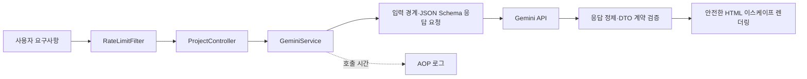

# ArchFlow 포트폴리오 가이드

## 한 줄 소개

LLM이 생성한 프로젝트 설계 문서를 **신뢰 경계 밖의 입력**으로 취급하고, 계약 검증·비용 보호·장애 대응·안전한 렌더링으로 통제한 AI-Native 백엔드 서비스입니다.

## 해결한 문제

| 운영 위험 | ArchFlow의 대응 |
| --- | --- |
| LLM이 JSON이 아닌 텍스트를 반환 | Gemini JSON Schema, 코드 블록 정제, DTO 필수 계약 검증 |
| AI 호출 비용과 어뷰징 | IP별 토큰 버킷 요청 제한 및 429/Retry-After 응답 |
| 외부 API 지연 또는 실패 | 연결·응답 타임아웃, 502/503 표준 오류 응답 |
| AI 텍스트의 브라우저 실행 위험 | 모든 동적 값 HTML 이스케이프 처리 |
| 느린 AI 호출의 원인 추적 | AOP 기반 호출 시간 측정 및 8초 초과 경고 |
| 사용자 문의와 서버 로그 연결 | `X-Request-Id` 응답 헤더와 MDC 로그 상관관계 |

## 동작 흐름

## 2분 데모 시나리오

1. `커머스 플랫폼`, `판매자와 구매자가 주문을 처리하는 서비스`, `Spring Boot, PostgreSQL`을 입력한다.
2. 생성된 README, API, DB, 폴더 구조, 체크리스트 탭을 확인한다.
3. 자동 분석 배너에서 설계의 누락 요소와 병목을 확인한다.
4. 같은 IP에서 요청 한도를 초과하면 429와 재시도 안내가 반환되는 점을 설명한다.

## 검증 범위

`mvnw test`는 다음을 확인합니다.

- 생성·분석 API의 정상 응답과 유효성 검증
- Gemini 응답의 정상 파싱, JSON Schema 요청, 잘못된 JSON 거부, API 키 누락 처리
- IP별 요청 제한과 429 JSON 응답, 요청 추적 ID 반환

## 의도적으로 남긴 다음 단계

- 다중 인스턴스 환경에서는 인메모리 버킷 대신 Redis 기반 분산 제한으로 교체
- WireMock 기반 외부 API 통합 테스트와 프롬프트 회귀 평가 세트 도입
- Circuit Breaker와 메트릭 대시보드로 장애 격리·비용 관측 고도화

이 한계를 명확히 기록한 이유는, 현재 구현의 적용 범위와 다음 설계 결정을 투명하게 보여 주기 위해서입니다.
